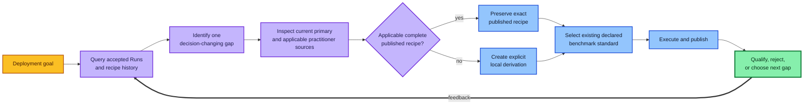

# LLM Rig implementation plan

Status: **Active plan. No executable LLM Rig pipeline exists yet.**

This document sequences implementation of the confirmed product requirements.
It is not a policy or a second specification. Requirements define what must be
shipped; the shared-results specification defines the publication contract;
this plan identifies the smallest working slices that prove the product.

## Status legend

- **Green — exists:** usable material or a real executed artifact exists now.
- **Yellow — partial:** useful material exists, but it is manual, legacy,
  unintegrated, or not yet authoritative in LLM Rig.
- **Blue — next build:** part of the first working vertical slice.
- **Red — missing:** required product capability with no implementation.
- **Gray — external:** an upstream tool or service LLM Rig integrates rather
  than implements.

## Current end-to-end status

```mermaid
flowchart LR
    Q["Deployment goal or<br/>serving question"]
    History["Prior-result query"]
    Research["Current-source research"]
    Recipe["Published or derived<br/>recipe record"]
    Registry["Declared benchmark<br/>standard registry"]
    AIPerf["AIPerf harness"]
    Runner["LLM Rig runner<br/>and engine adapter"]
    Raw["Existing Qwen raw run<br/>and artifact manifest"]
    Normalize["Normalizer and<br/>machine validator"]
    Publish["Shared Results<br/>publication client/API"]
    ObjectStore["Shared artifact store"]
    Notion["Notion Run schema<br/>and adapter"]
    Report["Notion Investigation<br/>generator"]
    Query["Recipe/result query<br/>for the next decision"]

    Q --> History --> Research --> Recipe --> Registry --> Runner
    AIPerf --> Runner
    Runner --> Normalize
    Raw --> Normalize
    Normalize --> Publish
    Publish --> ObjectStore
    Publish --> Notion
    ObjectStore --> Report
    Notion --> Report --> Query
    Query ==>|"feedback"| History

    classDef exists fill:#86EFAC,stroke:#15803D,color:#052E16,stroke-width:2px;
    classDef partial fill:#FDE68A,stroke:#B45309,color:#451A03,stroke-width:2px;
    classDef next fill:#93C5FD,stroke:#1D4ED8,color:#0F172A,stroke-width:3px;
    classDef missing fill:#FCA5A5,stroke:#B91C1C,color:#450A0A,stroke-width:2px;
    classDef external fill:#D1D5DB,stroke:#4B5563,color:#111827,stroke-width:2px;

    class Raw exists;
    class Research,Registry partial;
    class Normalize,Publish,Notion,Report next;
    class Q,History,Recipe,Runner,Query missing;
    class AIPerf,ObjectStore external;
```

Current reusable material is real but disconnected:

- The Qwen3.8 Q5 run directory contains AIPerf output, telemetry, exact runtime
  and model identity, a structured summary, and an artifact manifest.
- The deleted completed report and report template are recoverable from the
  recorded session.
- AIPerf is installed outside this repository and has already executed a run.
- Current AIPerf supports source-defined datasets and existing public workloads,
  including SPEED-Bench and SpecBench, but LLM Rig has no benchmark registry or
  executable definition yet.
- The legacy corpus contains a candidate routine SPEED-Bench convention, but it
  has not been imported, verified, and made executable in LLM Rig.

## What to implement next

Build **Vertical Slice 1: publish and retrieve the existing Qwen run through
the real shared-results path**.

This is the shortest route from documentation to a working product because it
uses a genuine run with nontrivial success, cancellation, token, telemetry, and
artifact semantics. It exercises the hard data path without consuming more GPU
time or inventing a new benchmark.

```mermaid
flowchart LR
    Restore["1 · Restore Qwen report<br/>and reusable template"]
    Schemas["2 · Implement schemas<br/>Recipe · Benchmark ref · Run<br/>Manifest · Receipt"]
    CLI["3 · Implement llm-rig CLI<br/>normalize · validate"]
    Fixture["4 · Normalize existing<br/>Qwen run without manually<br/>retyping measurements"]
    Service["5 · Implement publication<br/>API + artifact adapter<br/>+ Notion adapter"]
    Commit["6 · Publish once<br/>and receive receipt"]
    Read["7 · Query the Run back<br/>through the shared API"]
    Investigation["8 · Generate the Notion<br/>Investigation from the Run"]

    Restore --> Schemas --> CLI --> Fixture --> Service --> Commit --> Read --> Investigation

    classDef existing fill:#86EFAC,stroke:#15803D,color:#052E16,stroke-width:2px;
    classDef build fill:#93C5FD,stroke:#1D4ED8,color:#0F172A,stroke-width:3px;
    classDef result fill:#6EE7B7,stroke:#047857,color:#052E16,stroke-width:3px;

    class Restore,Schemas,CLI,Fixture,Service,Commit,Read build;
    class Investigation result;
```

### Vertical Slice 1 deliverables

1. A cross-platform `llm-rig` CLI and package skeleton.
2. Versioned schemas for Recipe, Benchmark reference, Run, artifact manifest,
   publication request, and receipt.
3. A Qwen run importer that derives normalized fields from the existing files;
   it must not copy numbers from report prose.
4. A validator that checks hashes, required identities, actual token work,
   execution state, and the distinction between the completed short requests
   and cancelled long requests.
5. The Shared Results API and runner-side publication client.
6. One selected shared artifact-store adapter with content-hash verification.
7. A Notion schema installer and Run adapter.
8. A Notion Investigation template based on the recovered completed-run report.
9. A query command used by later recipe investigations.
10. Contract tests plus one live end-to-end test.

### Vertical Slice 1 acceptance

The slice is complete only when all of the following are true:

- `llm-rig normalize <qwen-run-directory>` produces a schema-valid Run and
  manifest without manually typed measurements.
- Hash or semantic tampering causes validation to fail.
- Publication uploads the declared artifacts and creates exactly one Notion Run.
- Interrupting and retrying publication does not duplicate or overwrite the Run.
- Querying by run ID returns the same normalized identities, states, and hashes.
- The Notion Investigation is generated from the accepted Run and contains the
  recovered report's practical outcome, limitations, and artifact links.
- The restored local report remains until the Notion replacement is verified.

## Vertical Slice 2 — execute an existing benchmark standard

After publication works, make the producer real by executing one existing
upstream benchmark through the same path.

The initial candidate is AIPerf's supported
[SPEED-Bench throughput workload](https://github.com/ai-dynamo/aiperf/blob/main/docs/tutorials/speed-bench.md),
starting with the existing `throughput_8k` convention already identified in the
legacy corpus. Before adoption, pin and verify the upstream dataset/preparer,
license conditions, tokenizer, workload hash, AIPerf version, completion rule,
and validator. If that verification shows that it is not the right existing
standard for the named serving question, select another declared AIPerf-supported
benchmark such as
[SpecBench](https://github.com/ai-dynamo/aiperf/blob/main/docs/tutorials/spec-bench.md);
do not invent a local prompt as a shortcut.

```mermaid
flowchart LR
    Catalog["Verify existing upstream<br/>benchmark standard"]
    Declare["Register immutable<br/>definition + validator"]
    Candidate["Research one sourced<br/>Qwen recipe candidate"]
    Start["Target or launch<br/>one endpoint"]
    Execute["Execute with AIPerf"]
    Validate["Validate actual work<br/>and benchmark completion"]
    Shared["Publish through the<br/>same shared-results path"]
    Learn["Use accepted Run in<br/>the next recipe decision"]

    Catalog --> Declare --> Candidate --> Start --> Execute --> Validate --> Shared --> Learn

    classDef research fill:#C4B5FD,stroke:#6D28D9,color:#1E1B4B,stroke-width:2px;
    classDef build fill:#93C5FD,stroke:#1D4ED8,color:#0F172A,stroke-width:3px;
    classDef external fill:#D1D5DB,stroke:#4B5563,color:#111827,stroke-width:2px;
    classDef outcome fill:#86EFAC,stroke:#15803D,color:#052E16,stroke-width:3px;

    class Catalog,Candidate research;
    class Declare,Start,Execute,Validate,Shared build;
    class Learn outcome;
```

### Vertical Slice 2 acceptance

- The benchmark definition was imported from and linked to a current upstream
  standard rather than invented for the run.
- The executable command, dataset and tokenizer revisions, hashes, request
  schedule, completion rules, and validator are versioned.
- AIPerf runs without reconstructing choices from prose.
- The validator reads AIPerf outputs and independently determines whether the
  standard completed.
- The resulting Run, artifacts, and Investigation use the same publication and
  query path proven in Vertical Slice 1.

## Vertical Slice 3 — automate recipe investigation

Only after the shared query and executable benchmark paths work should recipe
research be automated.

The recipe investigator must return a structured source and derivation record,
not merely prose. It may recommend one experiment or no experiment. It does not
automatically create a configuration matrix.

## Expansion order after the vertical slices

1. Add a second serving engine through the same endpoint, benchmark, validator,
   and publication contracts.
2. Add additional existing benchmark standards only for named serving questions.
3. Add additional hardware surfaces without creating host-specific histories.
4. Add scheduled regression execution only after manual end-to-end publication
   and query are reliable.
5. Add continuous service monitoring as a separate pipeline; do not turn every
   monitoring sample into a benchmark Run.

## Stop condition for planning

No additional architecture document is needed before Vertical Slice 1 begins.
The next repository change should contain executable schemas, code, and tests.
